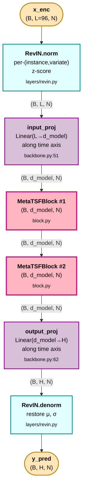
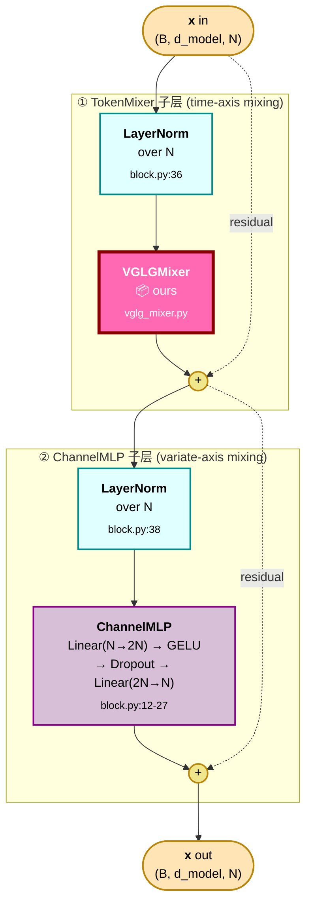
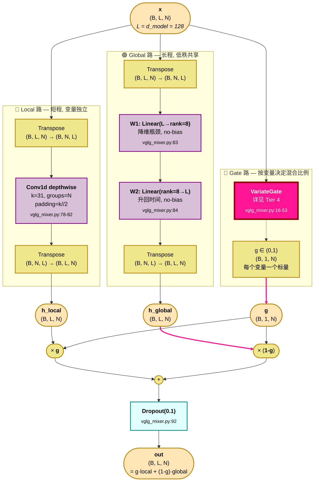
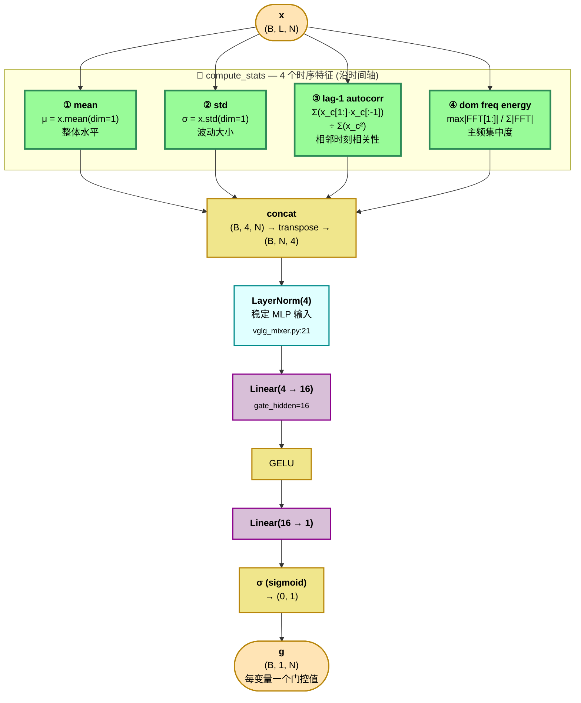

# VGLG 架构图 — 与代码 1:1 对应

> **VGLG** = **V**ariate-**G**ated **L**ocal-**G**lobal TokenMixer
> 嵌在共享的 MetaTSF 骨干里，只换 TokenMixer 这一块，跟 MLP/Conv/Attn 三个对照组做公平对比。

输入张量约定：`(B, L, N)` — `B` 批次、`L=seq_len=96`、`N` 变量数（数据集决定）。
输出 `(B, H, N)` — `H=pred_len ∈ {96, 192, 336, 720}`。

最终调优配方（[`metatsf_tuned2` commit 0200a57](../scripts/run_metatsf_tuned2.sh)）：30 epoch · lr=1e-3 · cosine LR · patience=8 · weight_decay=1e-3 · `d_model=128` · `n_layers=2` · `dropout=0.1`。Avg(7) MSE = **0.359**（排名 #7/12）。

---

## Tier 1 — 全模型 forward pass

> 文件 [src/models/metatsf/backbone.py:64-76](../src/models/metatsf/backbone.py#L64-L76)



---

## Tier 2 — MetaTSFBlock（每一层）

> 文件 [src/models/metatsf/block.py:30-45](../src/models/metatsf/block.py#L30-L45)
> 结构：**Norm → TokenMixer → +residual → Norm → ChannelMLP → +residual**
> 这就是 MetaFormer 的标准 abstraction（Yu et al., CVPR 2022 Oral），所有 4 个 mixer 公用这套骨架。



> **设计要点**：MetaTSFBlock 把"沿时间轴混"（TokenMixer）和"沿变量轴混"（ChannelMLP）解耦成两个子层 — 各自前面挂 LayerNorm + 后面带残差。把 TokenMixer 换成 MLP/Conv/Attn/VGLG 就是 4 个 baseline 的全部差异，骨干一字不改。

---

## Tier 3 — VGLGMixer 核心（**我们的方法**）

> 文件 [src/models/metatsf/mixers/vglg_mixer.py:56-106](../src/models/metatsf/mixers/vglg_mixer.py#L56-L106)
> 三路并行：**Local conv（变量独立） + Global low-rank（长程混合） + Gate（按变量决定融合比例）**



### 公式（一行版）

```
out = g ⊙ Conv1d_depthwise_k31(x)  +  (1-g) ⊙ W₂(W₁(x))
       └──── Local（HF / 短程） ────┘    └─ Global（LF / 长程） ─┘
       g = VariateGate(x) ∈ (0,1)^N         按变量自适应
```

> **设计直觉**：能不能用一个 mixer 同时把"短窗口的局部抖动（如季节性）"和"长窗口的整体走势（如趋势）"都覆盖？
> — Local 走 depthwise conv k=31（每个变量独立的 1D 卷积，参数极少）；Global 走低秩瓶颈 L→8→L（鼓励学到全局慢变化）；每个变量按自己的统计特征决定信"局部"还是信"全局"。
> 消融（`gate_mode` 字段）：`fixed_1.0`=只用 Local；`fixed_0.0`=只用 Global；`fixed_0.5`=固定 50/50；`learned`=默认。

---

## Tier 4 — VariateGate（4 统计量 → 标量门）

> 文件 [src/models/metatsf/mixers/vglg_mixer.py:16-53](../src/models/metatsf/mixers/vglg_mixer.py#L16-L53)
> 输入 `(B, L, N)`，输出 `g ∈ (0,1)^(B, 1, N)`。
> 不引入新可学时间参数 — 仅看每条序列自己的 4 个统计特征。



### 4 个统计量的物理含义

| 统计量 | 公式 | 想表达什么 | 高值 → gate 倾向 |
|---|---|---|---|
| **① mean** μ | `x.mean(dim=1)` | 序列整体水平 | 中性，仅作 MLP 输入归一化锚点 |
| **② std** σ | `x.std(dim=1, unbiased=False)` | 波动大小 | 大 → 噪声多 → 可能偏好 Global（平滑） |
| **③ lag-1 autocorr** | `Σ(x_c[t]·x_c[t-1]) / Σ x_c²` | 相邻时刻相关性，越接近 1 越平滑 | 接近 1 → 平滑序列 → 偏好 Local（卷积够用） |
| **④ dom freq energy** | `max\|FFT[1:]\| / Σ\|FFT\|` | 主频在全频谱里的占比，越大越像规则周期 | 大 → 强周期 → 偏好 Local（k=31 卷积捕获季节性） |

> **为什么 4 个就够？** 这些是"决定该用短程还是长程"的最少充分量。再加更多（峰度、偏度、HF/LF 能量比、…）会让 gate MLP 参数膨胀但带来的判别力递减。

---

## 关键超参数（[`configs/model/metatsf_vglg.yaml`](../configs/model/metatsf_vglg.yaml)）

| 字段 | 值 | 含义 |
|---|---|---|
| `d_model` | 128 | 输入投影后的"时间"维 |
| `n_layers` | 2 | MetaTSFBlock 堆几层 |
| `dropout` | 0.1 | Block + Mixer 都用 |
| `channel_mlp_mult` | 2 | ChannelMLP 隐藏层宽 = 2N |
| `revin / affine` | true / true | RevIN 带可学习仿射 |
| `mixer.kernel_size` | **31** | Local depthwise conv 核大小 |
| `mixer.rank` | **8** | Global 低秩瓶颈 |
| `mixer.gate_hidden` | 16 | VariateGate MLP 隐藏层 |
| `mixer.gate_mode` | learned | 消融用：`fixed_0.0` / `fixed_0.5` / `fixed_1.0` |
| `mixer.gate_entropy_reg` | 0.0 | 可选 entropy reg（默认关，保留为消融用） |

训练配方（[`scripts/run_metatsf_tuned2.sh`](../scripts/run_metatsf_tuned2.sh)）：
`30 epoch · lr=1e-3 · cosine · patience=8 · weight_decay=1e-3 · batch_size=32`

---

## 参数量预算（h=96，ETTh1 N=7 为例）

| 模块 | 形状 | 参数量 |
|---|---|---|
| RevIN affine | 2·N | 14 |
| input_proj | L·d_model = 96·128 | 12,288 |
| MetaTSFBlock × 2: | | |
| ┊ LayerNorm × 2 | 2·2·N | 28 |
| ┊ VGLGMixer.local_conv (depthwise k=31, groups=N) | N·k + N | 224 |
| ┊ VGLGMixer.W1 (no bias) | d_model·rank = 128·8 | 1,024 |
| ┊ VGLGMixer.W2 (no bias) | rank·d_model = 8·128 | 1,024 |
| ┊ VGLGMixer.gate (LN(4) + 4·16 + 16·1 + 17) | — | 113 |
| ┊ ChannelMLP (N→2N→N) | 2·(2N·N + N) ≈ | 126 |
| × 2 layers → | | ≈ 5,038 |
| output_proj | d_model·H = 128·96 | 12,288 |
| **总计** | | **≈ 30 K** |

> **跟 Chronos-Bolt 老师对比**：VGLG ≈ **30K** 参数；Chronos-Bolt-Base ≈ **205M** 参数 — **约 6,800 × 小**。这就是为什么蒸馏（KD）有意义：把大模型在 foundation training distribution 上学到的归纳偏置压到 30K 的学生里。

---

## 代码 ↔ 图节点 速查表

| 图里的节点 | 对应代码 |
|---|---|
| Tier 1: RevIN | [`src/models/layers/revin.py`](../src/models/layers/revin.py) |
| Tier 1: input_proj / output_proj | [`src/models/metatsf/backbone.py:51,62`](../src/models/metatsf/backbone.py#L51) |
| Tier 1: 整体 forward | [`backbone.py:64-76`](../src/models/metatsf/backbone.py#L64-L76) |
| Tier 2: MetaTSFBlock | [`block.py:30-45`](../src/models/metatsf/block.py#L30-L45) |
| Tier 2: ChannelMLP | [`block.py:12-27`](../src/models/metatsf/block.py#L12-L27) |
| Tier 3: Local 路（Conv1d） | [`vglg_mixer.py:78-82`](../src/models/metatsf/mixers/vglg_mixer.py#L78-L82) |
| Tier 3: Global 路（W₁ / W₂） | [`vglg_mixer.py:83-84`](../src/models/metatsf/mixers/vglg_mixer.py#L83-L84) |
| Tier 3: 融合 g·local + (1-g)·global | [`vglg_mixer.py:105`](../src/models/metatsf/mixers/vglg_mixer.py#L105) |
| Tier 4: compute_stats（4 统计量） | [`vglg_mixer.py:29-47`](../src/models/metatsf/mixers/vglg_mixer.py#L29-L47) |
| Tier 4: VariateGate MLP | [`vglg_mixer.py:23-27`](../src/models/metatsf/mixers/vglg_mixer.py#L23-L27) |
| Gate 可视化 hook | [`vglg_mixer.py:94, 104`](../src/models/metatsf/mixers/vglg_mixer.py#L94) (`self._last_gate`) |
| Optional gate entropy 正则 | [`vglg_mixer.py:108-117`](../src/models/metatsf/mixers/vglg_mixer.py#L108-L117) |
